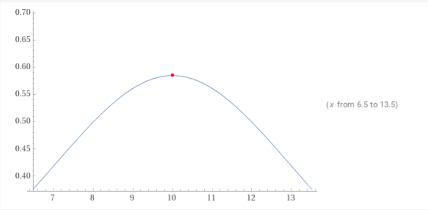

3. Bathymetry & Boundary Conditions | Project Report
===========================================================

Introduction of Bathymetry through non-zero source term
-------------------------------------------------------

Introduced the bathymetry through calculation of :math:`\Delta x \Psi_{i-1/2}` into the FWave solver.

:math:`\Delta x \Psi_{i-1/2} := \begin{bmatrix} 0 \\ -g (b_r - b_l) \frac{h_l+h_r}{2} \end{bmatrix}` :

.. code-block:: c++
  
  void FWave::computedxPsi(real in_stateLeft[3], real in_stateRight[3], real out_dxPsi) {
	real heightLeft = in_stateLeft[0]
	real heightRight = in_stateRight[0]
	real bathymetryLeft = in_stateLeft[2];
	real bathymetryRight = in_stateRight[2];
	
	//	 -g	  *	 bathymetryRight - bathymetryLeft  *  heightLeft + heightRight   / 2
	out_dxPsi = (-const_g * (bathymetryRight - bathymetryLeft) * ((heightLeft + heightRight) / 2))
  }

:math:`\Delta f - \Delta x \Psi_{i-1/2}` :

.. code-block:: c++

  void FWave::computeEigencoefficients(real in_stateLeft[3], real in_stateRight[3], real in_invertedEigenmatrix[2][2], real out_eigencoefficients[2]) {
	real fluxJumpLeft[2];
	real fluxJumpRight[2];
	real dxPsi;

	flux(in_stateLeft, fluxJumpLeft);
	flux(in_stateRight, fluxJumpRight);
	computedxPsi(in_stateLeft, in_stateRight, dxPsi);
	
	real fluxJump[2] = {
		fluxJumpRight[0] - fluxJumpLeft[0],
		fluxJumpRight[1] - fluxJumpLeft[1] - dxPsi
	};

	out_eigencoefficients[0] = in_invertedEigenmatrix[0][0] * fluxJump[0] + in_invertedEigenmatrix[0][1] * fluxJump[1];
	out_eigencoefficients[1] =	in_invertedEigenmatrix[1][0] * fluxJump[0] + in_invertedEigenmatrix[1][1] * fluxJump[1];
  }

Example of bathymetry in extended solver
^^^^^^^^^^^^^^^^^^^^^^^^^^^^^^^^^^^^^^^^

Example visualization of the new bathymetry feature in the FWave solver.

.. video:: _static/bathymetry_sin.mp4
  :autoplay:
  :nocontrols:
  :loop:
  :height: 300
  :width: 650

Reflecting Boundary Conditions
------------------------------

Implemented open and reflecting boundary conditions in the setGhostOutflow function:

.. code-block:: c++

  void WavePropagation1d::setGhostOutflow( Boundary boundary[2] ) {
  	real * heightLocal = height[step];
  	real * momentumLocal = momentum[step];
  	real * bathymetryLocal = bathymetry;

  	// set left boundary
  	if(boundary[0] == OUTFLOW) {
		 heightLocal[0] = heightLocal[1];
	 	 momentumLocal[0] = momentumLocal[1];
		 bathymetryLocal[0] = bathymetryLocal[1];
  	} else if (boundary[0] == REFLECTING) {
		 heightLocal[0] = 0;
		 momentumLocal[0] = 0;
		 bathymetryLocal[0] = heightLocal[1]+bathymetryLocal[1]+1;
  	}

  	// set right boundary
  	if(boundary[1] == OUTFLOW) {
		 heightLocal[cellCount+1] = heightLocal[cellCount];
		 momentumLocal[cellCount+1] = momentumLocal[cellCount];
		 bathymetryLocal[cellCount+1] = bathymetryLocal[cellCount];
  	} else if(boundary[1] == REFLECTING) {
		 heightLocal[cellCount+1] = 0;
		 momentumLocal[cellCount+1] = 0;
		 bathymetryLocal[cellCount+1] = heightLocal[cellCount]+bathymetryLocal[cellCount]+1;
  	}

Therefore changed the main() command line input:

.. code-block:: c++

  // boundary conditions
  std::string boundaryLeftArg = in_argv[4];
  std::string boundaryRightArg = in_argv[5];
  tsunami_lab::Boundary boundary[2];
  if (boundaryLeftArg == "OUTFLOW") {
	    boundary[0] = tsunami_lab::OUTFLOW;
  } else if (boundaryLeftArg == "REFLECTING") {
	    boundary[0] = tsunami_lab::REFLECTING;
  } else {
	 std::cerr << "invalid boundary type for Left side. Please use either OUTFLOW or REFLECTING"
             << std::endl;
    return EXIT_FAILURE;
  }
  if (boundaryRightArg == "OUTFLOW") {
	 boundary[1] = tsunami_lab::OUTFLOW;
  } else if (boundaryRightArg == "REFLECTING") {
	 boundary[1] = tsunami_lab::REFLECTING;
  } else {
	 std::cerr << "invalid boundary type for Right side. Please use either OUTFLOW or REFLECTING"
             << std::endl;
    return EXIT_FAILURE;
  }

Shock-Shock Problem with Boundary Conditions
^^^^^^^^^^^^^^^^^^^^^^^^^^^^^^^^^^^^^^^^^^^^

.. .. video:: _static/...
..   :width: 700
..   :autoplay:
..   :loop:
..   :nocontrols:
..   :muted:

The Boundary Conditions for Reflection does not seem to work at the moment, therefore we couldn't compare the output to the one with normal conditions.

Hydraulic Jumps
---------------

Computation of the Froude number
^^^^^^^^^^^^^^^^^^^^^^^^^^^^^^^^

Computation of the maximum Froude number at inital time :math:`t = 0`.

subcritical setting:

.. math::

  \begin{aligned}
  F :&= \frac{u}{\sqrt{gh}} \\
  \\
  b(x) &= \begin{cases} -1.8 - 0.05 (x-10)^2 \quad &\text{if } x \in (8,12) \\ -2 \quad &\text{else} \end{cases}\\
  \\
  h(x, 0) &= -b(x) \quad \text{if } x \in [0,25] \\
          &= \begin{cases} 1.8 + 0.05 (x-10)^2 \\ 2 \end{cases}\\
  \\
  hu(x, 0) &= 4.42 \quad \text{if } x \in [0,25] \\
  \\
  u(x, 0) &= \frac{hu}{h} = \frac{4.42}{h} \\
  \\
  F = \frac{u}{\sqrt{gh}} &= \frac{4.42}{\sqrt{gh} * h} = \frac{4.42}{\sqrt{g} * h^\frac{1}{2} * h} = \frac{4.42}{\sqrt{g} * h^\frac{3}{2}} \\
  \end{aligned}

:math:`\text{max(F) achieved at x = 10}`

.. math::
  
  h &= 1.8+0.05*(10-10)^2 = 1.8 \\
  F &= \frac{4.42}{\sqrt{9.80665} * 1.8^\frac{3}{2}} \approx 0.58446\\

supercritical setting:

.. math::

  \begin{aligned}
  F :&= \frac{u}{\sqrt{gh}} \\
  \\
  b(x) &= \begin{cases} -0.13 - 0.05 (x-10)^2 \quad &\text{if } x \in (8,12) \\ -0.33 \quad &\text{else} \end{cases}\\
  \\
  h(x, 0) &= -b(x) \quad \text{if } x \in [0,25] \\
          &= \begin{cases} 0.13 + 0.05 (x-10)^2 \\ 0.33 \end{cases}\\
  \\
  hu(x, 0) &= 0.18 \quad \text{if } x \in [0,25] \\
  \\
  u(x, 0) &= \frac{hu}{h} = \frac{0.18}{h} \\
  \\
  F = \frac{u}{\sqrt{gh}} &= \frac{0.18}{\sqrt{gh} * h} = \frac{0.18}{\sqrt{g} * h^\frac{1}{2} * h} = \frac{0.18}{\sqrt{g} * h^\frac{3}{2}} \\
  \end{aligned}

:math:`\text{max(F) achieved at x = 10}`

.. image:: _static/supercritical.png
  :width: 700

.. math::
  
  h &= 0.13+0.05*(10-10)^2 = 0.13 \\
  F &= \frac{0.18}{\sqrt{9.80665} * 0.13^\frac{3}{2}} \approx 1.2263 \\

Implementation of Sub- / Supercritical Flow Setups
^^^^^^^^^^^^^^^^^^^^^^^^^^^^^^^^^^^^^^^^^^^^^^^^^^^

Implemented subcritical flow setup based on dambreak setup and the given values on the website.

.. code-block:: c++

  tsunami_lab::t_real tsunami_lab::setups::Subcritical1d::getHeight(t_real i_x,
                                                                    t_real) const
  {
    if (x >= 0 && x <= 25){
      return -getBathymetry;
    }
  }

  tsunami_lab::t_real tsunami_lab::setups::Subcritical1d::getMomentumX(t_real i_x,
                                                                       t_real) const
  {
    if (x >= 0 && x <= 25){
      return 4.42;
    }
  }

  tsunami_lab::t_real tsunami_lab::setups::Subcritical1d::getMomentumY(t_real,
                                                                       t_real) const
  {
    return 0;
  }

  tsunami_lab::t_real tsunami_lab::setups::Subcritical1d::getBathymetry(t_real in_x,
                                                                        t_real) const
  {
    if (x > 8 && x < 12){
      return (-1.8 - 0.05 * (x - 10)^2);
    }
    else {
      return -2;
    }
  }

Implemented supercritical flow setup based on subcritical setup and the given values on the website.

.. code-block:: c++

  tsunami_lab::t_real tsunami_lab::setups::Supercritical1d::getHeight(t_real i_x,
                                                                      t_real) const
  {
    if (x >= 0 && x <= 25){
      return -getBathymetry;
    }
  }

  tsunami_lab::t_real tsunami_lab::setups::Supercritical1d::getMomentumX(t_real i_x,
                                                                         t_real) const
  {
    if (x >= 0 && x <= 25){
      return 0.18;
    }
  }

  tsunami_lab::t_real tsunami_lab::setups::Supercritical1d::getMomentumY(t_real,
                                                                         t_real) const
  {
    return 0;
  }

  tsunami_lab::t_real tsunami_lab::setups::Supercritical1d::getBathymetry(t_real in_x,
                                                                          t_real) const
  {
    if (x > 8 && x < 12){
      return (-0.13 - 0.05 * (x - 10)^2);
    }
    else {
      return -0.33;
    }
  }

Individual Member Contributions
--------------------------------

Marek Sommerfeld: implementation of boundary conditions and bathymetry

Moritz Rätz: extended FWave solver, project report

